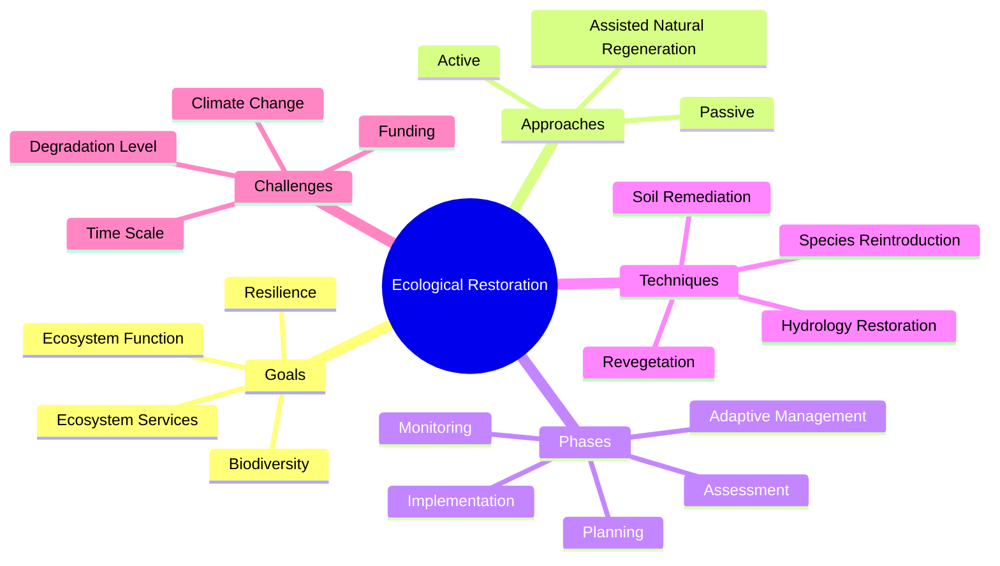

```mermaid
mindmap
  root((Ecological Restoration))
    Goals
      Ecosystem Function
      Biodiversity
      Resilience
      Ecosystem Services
    Approaches
      Passive
      Active
      Assisted Natural Regeneration
    Phases
      Assessment
      Planning
      Implementation
      Monitoring
      Adaptive Management
    Techniques
      Revegetation
      Soil Remediation
      Hydrology Restoration
      Species Reintroduction
    Challenges
      Degradation Level
      Funding
      Time Scale
      Climate Change
```

