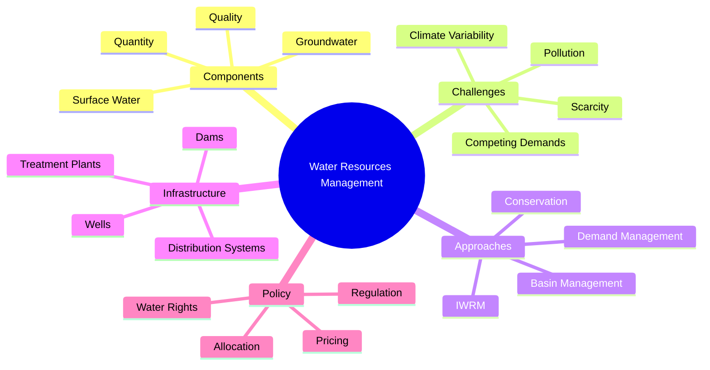

```mermaid
mindmap
  root((Water Resources Management))
    Components
      Surface Water
      Groundwater
      Quality
      Quantity
    Challenges
      Scarcity
      Pollution
      Climate Variability
      Competing Demands
    Approaches
      IWRM
      Basin Management
      Demand Management
      Conservation
    Infrastructure
      Dams
      Wells
      Treatment Plants
      Distribution Systems
    Policy
      Water Rights
      Allocation
      Pricing
      Regulation
```

