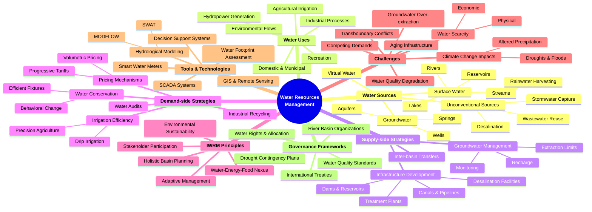

```mermaid
mindmap
  root((<b>Water Resources<br>Management</b>))
    <b>Water Sources</b>
      Surface Water
        Rivers
        Lakes
        Reservoirs
        Streams
      Groundwater
        Aquifers
        Wells
        Springs
      Unconventional Sources
        Desalination
        Wastewater Reuse
        Rainwater Harvesting
        Stormwater Capture
      Virtual Water
    <b>Water Uses</b>
      Domestic & Municipal
      Agricultural Irrigation
      Industrial Processes
      Hydropower Generation
      Environmental Flows
      Recreation
    <b>Supply-side Strategies</b>
      Infrastructure Development
        Dams & Reservoirs
        Canals & Pipelines
        Treatment Plants
        Desalination Facilities
      Groundwater Management
        Recharge
        Extraction Limits
        Monitoring
      Inter-basin Transfers
    <b>Demand-side Strategies</b>
      Water Conservation
        Efficient Fixtures
        Behavioral Change
      Irrigation Efficiency
        Drip Irrigation
        Precision Agriculture
      Industrial Recycling
      Pricing Mechanisms
        Volumetric Pricing
        Progressive Tariffs
      Water Audits
    <b>IWRM Principles</b>
      Holistic Basin Planning
      Stakeholder Participation
      Water-Energy-Food Nexus
      Environmental Sustainability
      Adaptive Management
    <b>Challenges</b>
      Water Scarcity
        Physical
        Economic
      Groundwater Over-extraction
      Water Quality Degradation
      Climate Change Impacts
        Altered Precipitation
        Droughts & Floods
      Competing Demands
      Transboundary Conflicts
      Aging Infrastructure
    <b>Tools & Technologies</b>
      GIS & Remote Sensing
      Hydrological Modeling
        SWAT
        MODFLOW
      Decision Support Systems
      Smart Water Meters
      SCADA Systems
      Water Footprint Assessment
    <b>Governance Frameworks</b>
      Water Rights & Allocation
      River Basin Organizations
      Water Quality Standards
      Drought Contingency Plans
      International Treaties
```

