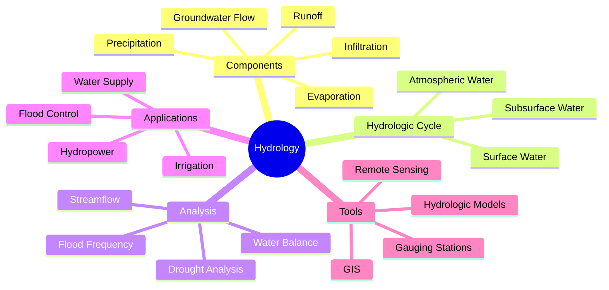

```mermaid
mindmap
  root((Hydrology))
    Components
      Precipitation
      Evaporation
      Infiltration
      Runoff
      Groundwater Flow
    Hydrologic Cycle
      Atmospheric Water
      Surface Water
      Subsurface Water
    Analysis
      Streamflow
      Flood Frequency
      Drought Analysis
      Water Balance
    Applications
      Water Supply
      Flood Control
      Irrigation
      Hydropower
    Tools
      Hydrologic Models
      GIS
      Remote Sensing
      Gauging Stations
```

