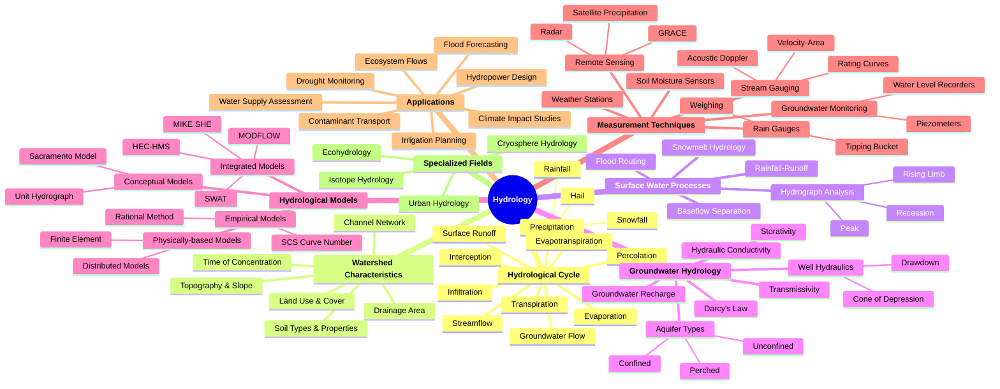

```mermaid
mindmap
  root((<b>Hydrology</b>))
    <b>Hydrological Cycle</b>
      Precipitation
        Rainfall
        Snowfall
        Hail
      Interception
      Evaporation
      Transpiration
      Evapotranspiration
      Infiltration
      Percolation
      Surface Runoff
      Streamflow
      Groundwater Flow
    <b>Watershed Characteristics</b>
      Drainage Area
      Topography & Slope
      Soil Types & Properties
      Land Use & Cover
      Channel Network
      Time of Concentration
    <b>Surface Water Processes</b>
      Rainfall-Runoff
      Hydrograph Analysis
        Rising Limb
        Peak
        Recession
      Flood Routing
      Baseflow Separation
      Snowmelt Hydrology
    <b>Groundwater Hydrology</b>
      Aquifer Types
        Confined
        Unconfined
        Perched
      Darcy's Law
      Hydraulic Conductivity
      Transmissivity
      Storativity
      Groundwater Recharge
      Well Hydraulics
        Drawdown
        Cone of Depression
    <b>Hydrological Models</b>
      Empirical Models
        Rational Method
        SCS Curve Number
      Conceptual Models
        Unit Hydrograph
        Sacramento Model
      Physically-based Models
        Distributed Models
        Finite Element
      Integrated Models
        SWAT
        HEC-HMS
        MIKE SHE
        MODFLOW
    <b>Measurement Techniques</b>
      Rain Gauges
        Tipping Bucket
        Weighing
      Stream Gauging
        Rating Curves
        Velocity-Area
        Acoustic Doppler
      Groundwater Monitoring
        Piezometers
        Water Level Recorders
      Soil Moisture Sensors
      Weather Stations
      Remote Sensing
        Satellite Precipitation
        GRACE
        Radar
    <b>Applications</b>
      Flood Forecasting
      Water Supply Assessment
      Drought Monitoring
      Irrigation Planning
      Hydropower Design
      Contaminant Transport
      Ecosystem Flows
      Climate Impact Studies
    <b>Specialized Fields</b>
      Urban Hydrology
      Ecohydrology
      Isotope Hydrology
      Cryosphere Hydrology
```

