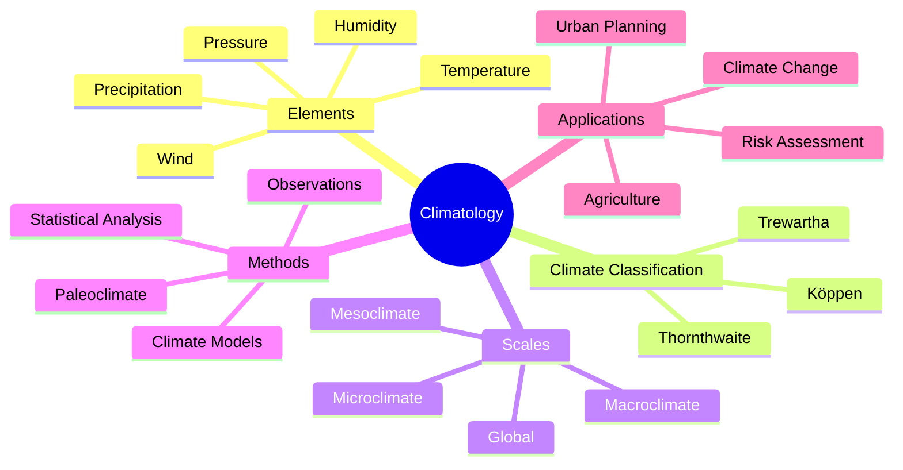

```mermaid
mindmap
  root((Climatology))
    Elements
      Temperature
      Precipitation
      Humidity
      Wind
      Pressure
    Climate Classification
      Köppen
      Thornthwaite
      Trewartha
    Scales
      Microclimate
      Mesoclimate
      Macroclimate
      Global
    Methods
      Statistical Analysis
      Climate Models
      Paleoclimate
      Observations
    Applications
      Agriculture
      Urban Planning
      Climate Change
      Risk Assessment
```

