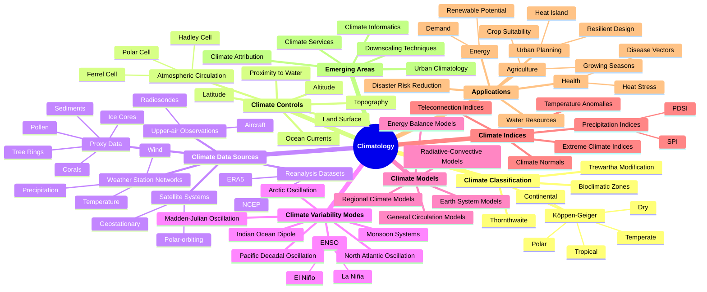

```mermaid
mindmap
  root((<b>Climatology</b>))
    <b>Climate Classification</b>
      Köppen-Geiger
        Tropical
        Dry
        Temperate
        Continental
        Polar
      Thornthwaite
      Trewartha Modification
      Bioclimatic Zones
    <b>Climate Controls</b>
      Latitude
      Altitude
      Proximity to Water
      Ocean Currents
      Atmospheric Circulation
        Hadley Cell
        Ferrel Cell
        Polar Cell
      Topography
      Land Surface
    <b>Climate Data Sources</b>
      Weather Station Networks
        Temperature
        Precipitation
        Wind
      Upper-air Observations
        Radiosondes
        Aircraft
      Satellite Systems
        Geostationary
        Polar-orbiting
      Reanalysis Datasets
        ERA5
        NCEP
      Proxy Data
        Ice Cores
        Sediments
        Tree Rings
        Corals
        Pollen
    <b>Climate Variability Modes</b>
      ENSO
        El Niño
        La Niña
      Pacific Decadal Oscillation
      North Atlantic Oscillation
      Arctic Oscillation
      Indian Ocean Dipole
      Madden-Julian Oscillation
      Monsoon Systems
    <b>Climate Models</b>
      Energy Balance Models
      Radiative-Convective Models
      General Circulation Models
      Regional Climate Models
      Earth System Models
    <b>Climate Indices</b>
      Temperature Anomalies
      Precipitation Indices
        SPI
        PDSI
      Teleconnection Indices
      Extreme Climate Indices
      Climate Normals
    <b>Applications</b>
      Agriculture
        Growing Seasons
        Crop Suitability
      Water Resources
      Urban Planning
        Heat Island
        Resilient Design
      Energy
        Renewable Potential
        Demand
      Health
        Disease Vectors
        Heat Stress
      Disaster Risk Reduction
    <b>Emerging Areas</b>
      Climate Services
      Urban Climatology
      Climate Attribution
      Downscaling Techniques
      Climate Informatics
```

