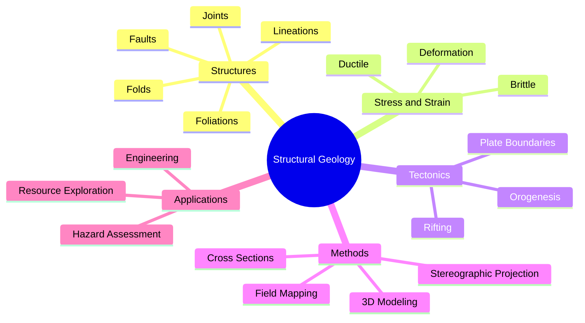

```mermaid
mindmap
  root((Structural Geology))
    Structures
      Folds
      Faults
      Joints
      Foliations
      Lineations
    Stress and Strain
      Deformation
      Brittle
      Ductile
    Tectonics
      Plate Boundaries
      Orogenesis
      Rifting
    Methods
      Field Mapping
      Stereographic Projection
      Cross Sections
      3D Modeling
    Applications
      Resource Exploration
      Hazard Assessment
      Engineering
```

