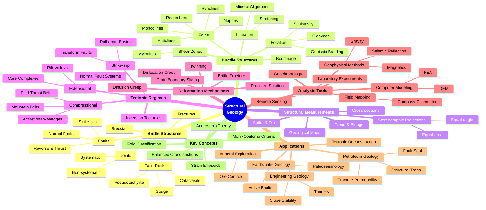

```mermaid
mindmap
  root((<b>Structural<br>Geology</b>))
    <b>Brittle Structures</b>
      Faults
        Normal Faults
        Reverse & Thrust
        Strike-slip
      Joints
        Systematic
        Non-systematic
      Fractures
      Breccias
      Fault Rocks
        Gouge
        Cataclasite
        Pseudotachylite
    <b>Ductile Structures</b>
      Folds
        Anticlines
        Synclines
        Monoclines
        Recumbent
        Nappes
      Foliation
        Cleavage
        Schistosity
        Gneissic Banding
      Lineation
        Mineral Alignment
        Stretching
      Shear Zones
        Mylonites
      Boudinage
    <b>Structural Measurements</b>
      Strike & Dip
      Trend & Plunge
      Stereographic Projections
        Equal-area
        Equal-angle
      Cross-sections
      Geological Maps
    <b>Tectonic Regimes</b>
      Compressional
        Mountain Belts
        Fold-Thrust Belts
        Accretionary Wedges
      Extensional
        Rift Valleys
        Normal Fault Systems
        Core Complexes
      Strike-slip
        Transform Faults
        Pull-apart Basins
      Inversion Tectonics
    <b>Deformation Mechanisms</b>
      Brittle Fracture
      Pressure Solution
      Dislocation Creep
      Diffusion Creep
      Grain Boundary Sliding
      Twinning
    <b>Analysis Tools</b>
      Field Mapping
        Compass-Clinometer
      Remote Sensing
      Geophysical Methods
        Seismic Reflection
        Gravity
        Magnetics
      Laboratory Experiments
      Computer Modeling
        FEA
        DEM
      Geochronology
    <b>Applications</b>
      Petroleum Geology
        Structural Traps
        Fault Seal
        Fracture Permeability
      Mineral Exploration
        Ore Controls
      Earthquake Geology
        Active Faults
        Paleoseismology
      Engineering Geology
        Slope Stability
        Tunnels
      Tectonic Reconstruction
    <b>Key Concepts</b>
      Anderson's Theory
      Mohr-Coulomb Criteria
      Fold Classification
      Balanced Cross-sections
      Strain Ellipsoids
```

