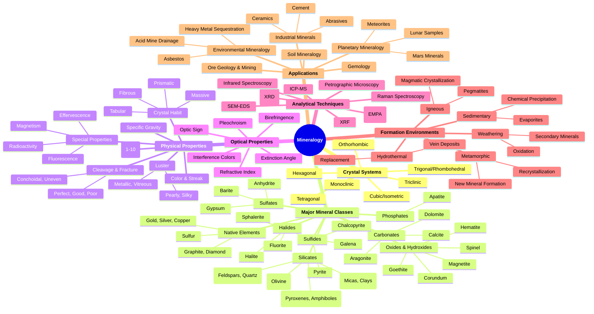

```mermaid
mindmap
  root((<b>Mineralogy</b>))
    <b>Crystal Systems</b>
      Cubic/Isometric
      Tetragonal
      Orthorhombic
      Monoclinic
      Triclinic
      Hexagonal
      Trigonal/Rhombohedral
    <b>Major Mineral Classes</b>
      Silicates
        Nesosilicates (Olivine)
        Inosilicates (Pyroxenes, Amphiboles)
        Phyllosilicates (Micas, Clays)
        Tectosilicates (Feldspars, Quartz)
      Carbonates
        Calcite
        Dolomite
        Aragonite
      Oxides & Hydroxides
        Hematite
        Magnetite
        Corundum
        Spinel
        Goethite
      Sulfides
        Pyrite
        Galena
        Sphalerite
        Chalcopyrite
      Sulfates
        Gypsum
        Anhydrite
        Barite
      Halides
        Halite
        Fluorite
      Phosphates
        Apatite
      Native Elements
        Gold, Silver, Copper
        Sulfur
        Graphite, Diamond
    <b>Physical Properties</b>
      Mohs Hardness (1-10)
      Cleavage & Fracture
        Perfect, Good, Poor
        Conchoidal, Uneven
      Luster
        Metallic, Vitreous
        Pearly, Silky
      Color & Streak
      Specific Gravity
      Crystal Habit
        Prismatic
        Tabular
        Fibrous
        Massive
      Special Properties
        Magnetism
        Fluorescence
        Radioactivity
        Effervescence
    <b>Optical Properties</b>
      Refractive Index
      Birefringence
      Pleochroism
      Extinction Angle
      Optic Sign
      Interference Colors
    <b>Analytical Techniques</b>
      X-ray Diffraction (XRD)
      Electron Microprobe (EMPA)
      SEM-EDS
      Raman Spectroscopy
      Infrared Spectroscopy
      XRF
      ICP-MS
      Petrographic Microscopy
    <b>Formation Environments</b>
      Igneous
        Magmatic Crystallization
        Pegmatites
      Metamorphic
        Recrystallization
        New Mineral Formation
      Hydrothermal
        Vein Deposits
        Replacement
      Sedimentary
        Evaporites
        Chemical Precipitation
      Weathering
        Secondary Minerals
        Oxidation
    <b>Applications</b>
      Ore Geology & Mining
      Gemology
      Environmental Mineralogy
        Asbestos
        Heavy Metal Sequestration
        Acid Mine Drainage
      Industrial Minerals
        Cement
        Ceramics
        Abrasives
      Soil Mineralogy
      Planetary Mineralogy
        Meteorites
        Lunar Samples
        Mars Minerals
```

