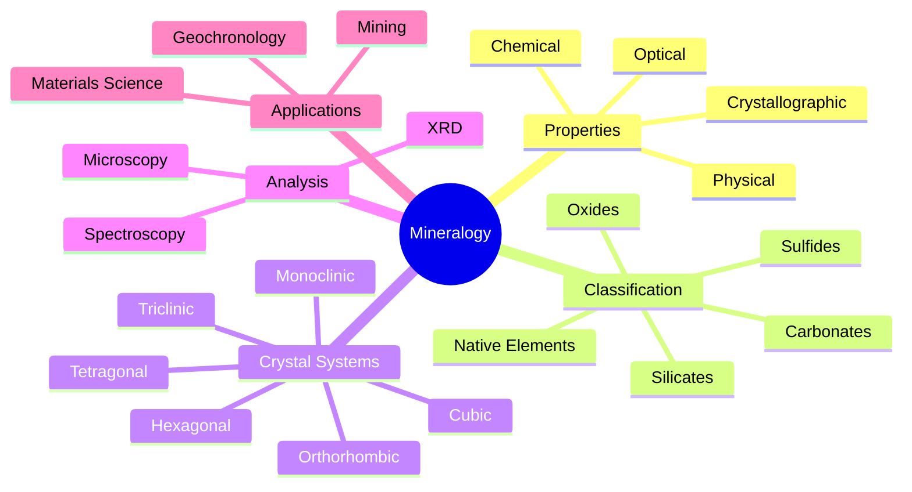

```mermaid
mindmap
  root((Mineralogy))
    Properties
      Physical
      Chemical
      Optical
      Crystallographic
    Classification
      Silicates
      Oxides
      Sulfides
      Carbonates
      Native Elements
    Crystal Systems
      Cubic
      Tetragonal
      Hexagonal
      Orthorhombic
      Monoclinic
      Triclinic
    Analysis
      XRD
      Microscopy
      Spectroscopy
    Applications
      Mining
      Materials Science
      Geochronology
```

