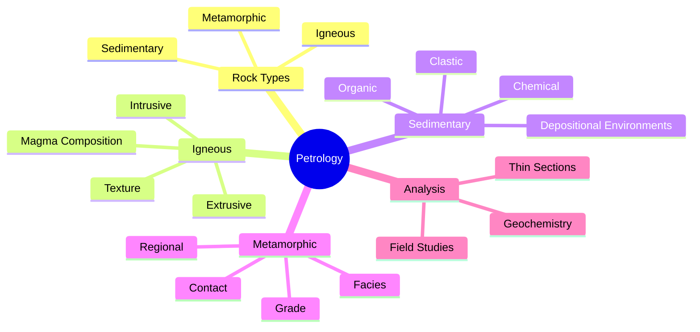

```mermaid
mindmap
  root((Petrology))
    Rock Types
      Igneous
      Sedimentary
      Metamorphic
    Igneous
      Intrusive
      Extrusive
      Magma Composition
      Texture
    Sedimentary
      Clastic
      Chemical
      Organic
      Depositional Environments
    Metamorphic
      Contact
      Regional
      Grade
      Facies
    Analysis
      Thin Sections
      Geochemistry
      Field Studies
```

