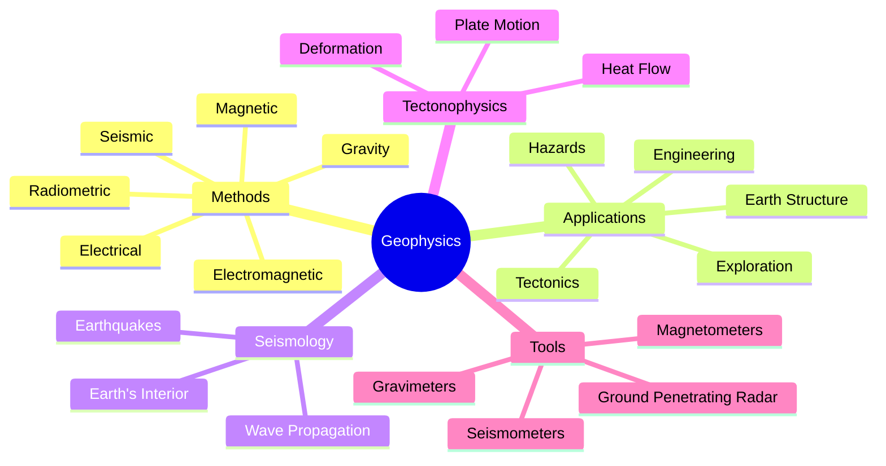

```mermaid
mindmap
  root((Geophysics))
    Methods
      Seismic
      Gravity
      Magnetic
      Electrical
      Electromagnetic
      Radiometric
    Applications
      Exploration
      Earth Structure
      Tectonics
      Hazards
      Engineering
    Seismology
      Earthquakes
      Wave Propagation
      Earth's Interior
    Tectonophysics
      Plate Motion
      Deformation
      Heat Flow
    Tools
      Seismometers
      Magnetometers
      Gravimeters
      Ground Penetrating Radar
```

