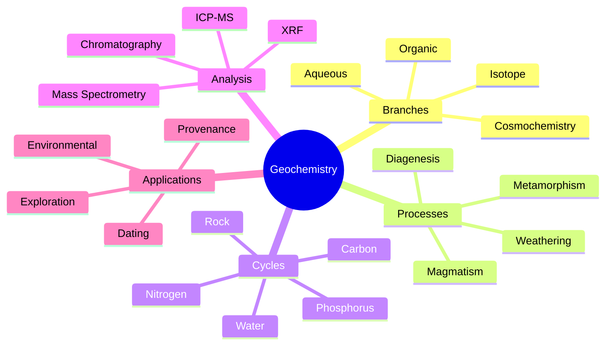

```mermaid
mindmap
  root((Geochemistry))
    Branches
      Aqueous
      Organic
      Isotope
      Cosmochemistry
    Processes
      Weathering
      Diagenesis
      Metamorphism
      Magmatism
    Cycles
      Carbon
      Nitrogen
      Phosphorus
      Water
      Rock
    Analysis
      Mass Spectrometry
      Chromatography
      ICP-MS
      XRF
    Applications
      Dating
      Provenance
      Environmental
      Exploration
```

