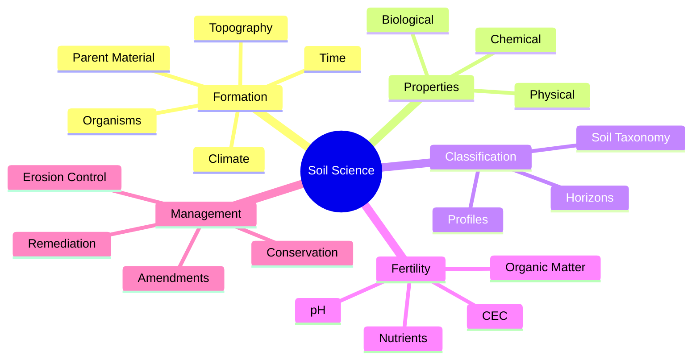

```mermaid
mindmap
  root((Soil Science))
    Formation
      Parent Material
      Climate
      Organisms
      Topography
      Time
    Properties
      Physical
      Chemical
      Biological
    Classification
      Soil Taxonomy
      Horizons
      Profiles
    Fertility
      Nutrients
      pH
      Organic Matter
      CEC
    Management
      Conservation
      Remediation
      Amendments
      Erosion Control
```

