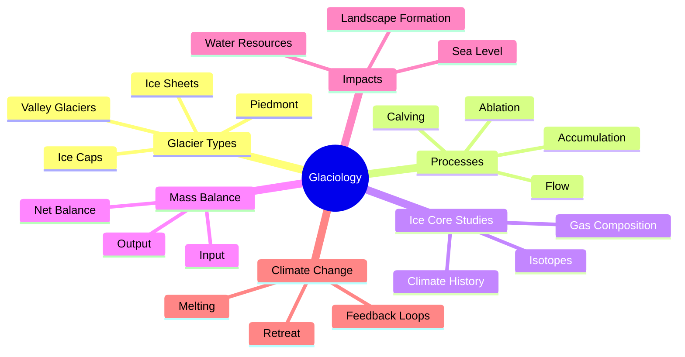

```mermaid
mindmap
  root((Glaciology))
    Glacier Types
      Ice Sheets
      Ice Caps
      Valley Glaciers
      Piedmont
    Processes
      Accumulation
      Ablation
      Flow
      Calving
    Ice Core Studies
      Climate History
      Gas Composition
      Isotopes
    Mass Balance
      Input
      Output
      Net Balance
    Impacts
      Sea Level
      Water Resources
      Landscape Formation
    Climate Change
      Retreat
      Melting
      Feedback Loops
```

