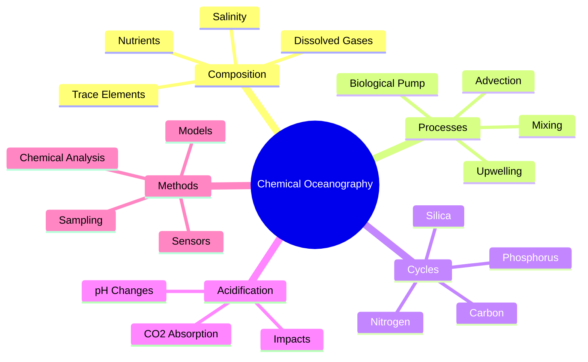

```mermaid
mindmap
  root((Chemical Oceanography))
    Composition
      Salinity
      Dissolved Gases
      Nutrients
      Trace Elements
    Processes
      Mixing
      Upwelling
      Advection
      Biological Pump
    Cycles
      Carbon
      Nitrogen
      Phosphorus
      Silica
    Acidification
      CO2 Absorption
      pH Changes
      Impacts
    Methods
      Sampling
      Chemical Analysis
      Sensors
      Models
```

