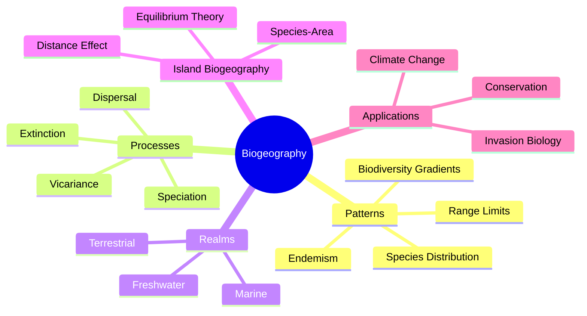

```mermaid
mindmap
  root((Biogeography))
    Patterns
      Species Distribution
      Endemism
      Biodiversity Gradients
      Range Limits
    Processes
      Dispersal
      Vicariance
      Speciation
      Extinction
    Realms
      Terrestrial
      Marine
      Freshwater
    Island Biogeography
      Species-Area
      Distance Effect
      Equilibrium Theory
    Applications
      Conservation
      Climate Change
      Invasion Biology
```

