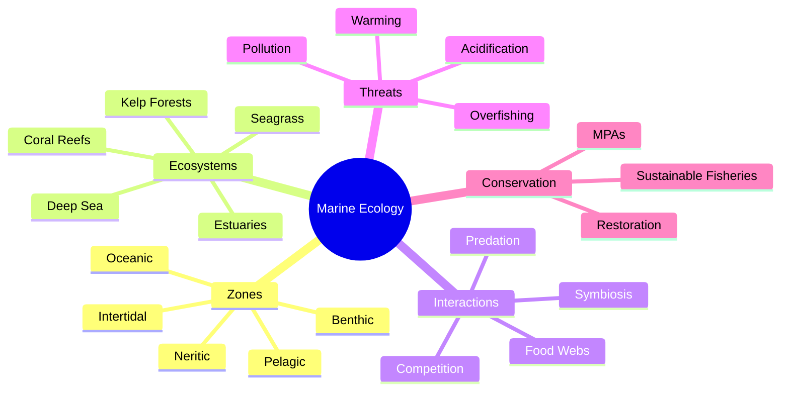

```mermaid
mindmap
  root((Marine Ecology))
    Zones
      Intertidal
      Neritic
      Oceanic
      Benthic
      Pelagic
    Ecosystems
      Coral Reefs
      Kelp Forests
      Seagrass
      Deep Sea
      Estuaries
    Interactions
      Food Webs
      Symbiosis
      Competition
      Predation
    Threats
      Overfishing
      Pollution
      Acidification
      Warming
    Conservation
      MPAs
      Sustainable Fisheries
      Restoration
```

