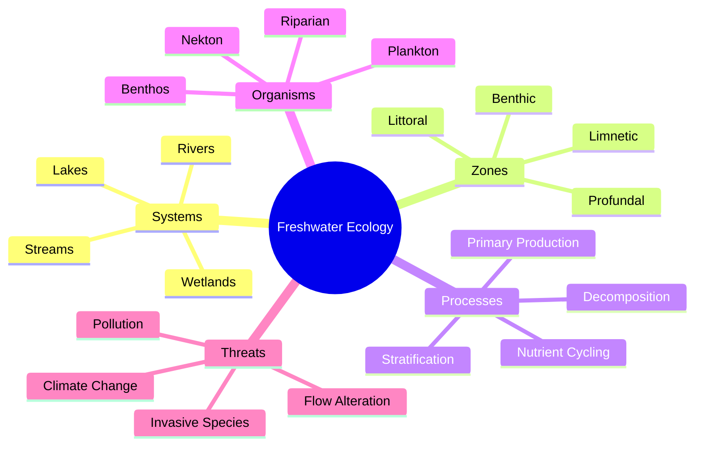

```mermaid
mindmap
  root((Freshwater Ecology))
    Systems
      Lakes
      Rivers
      Wetlands
      Streams
    Zones
      Littoral
      Limnetic
      Profundal
      Benthic
    Processes
      Stratification
      Nutrient Cycling
      Primary Production
      Decomposition
    Organisms
      Plankton
      Nekton
      Benthos
      Riparian
    Threats
      Pollution
      Invasive Species
      Flow Alteration
      Climate Change
```

