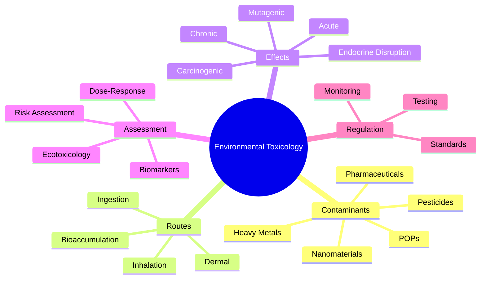

```mermaid
mindmap
  root((Environmental Toxicology))
    Contaminants
      Heavy Metals
      Pesticides
      POPs
      Pharmaceuticals
      Nanomaterials
    Routes
      Ingestion
      Inhalation
      Dermal
      Bioaccumulation
    Effects
      Acute
      Chronic
      Carcinogenic
      Mutagenic
      Endocrine Disruption
    Assessment
      Dose-Response
      Risk Assessment
      Biomarkers
      Ecotoxicology
    Regulation
      Standards
      Testing
      Monitoring
```

