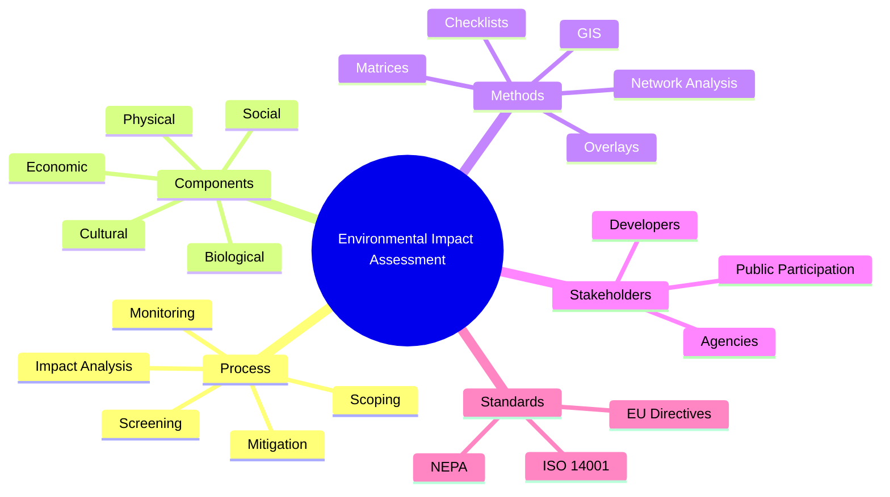

```mermaid
mindmap
  root((Environmental Impact Assessment))
    Process
      Screening
      Scoping
      Impact Analysis
      Mitigation
      Monitoring
    Components
      Physical
      Biological
      Social
      Economic
      Cultural
    Methods
      Checklists
      Matrices
      Overlays
      Network Analysis
      GIS
    Stakeholders
      Public Participation
      Agencies
      Developers
    Standards
      NEPA
      EU Directives
      ISO 14001
```

