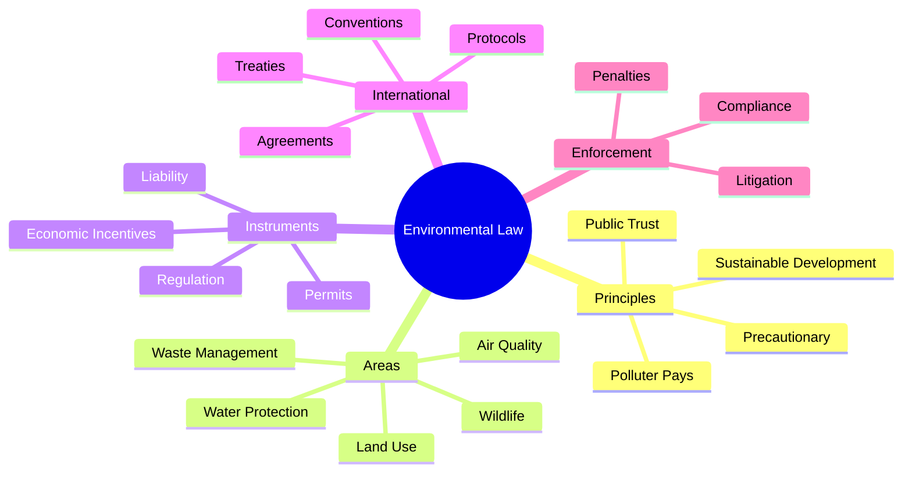

```mermaid
mindmap
  root((Environmental Law))
    Principles
      Precautionary
      Polluter Pays
      Public Trust
      Sustainable Development
    Areas
      Air Quality
      Water Protection
      Waste Management
      Wildlife
      Land Use
    Instruments
      Regulation
      Permits
      Liability
      Economic Incentives
    International
      Treaties
      Conventions
      Protocols
      Agreements
    Enforcement
      Compliance
      Penalties
      Litigation
```

