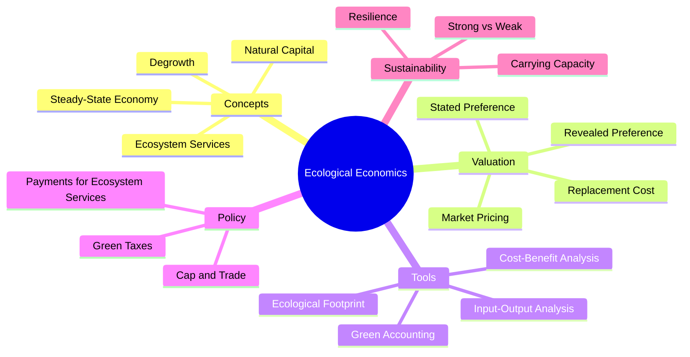

```mermaid
mindmap
  root((Ecological Economics))
    Concepts
      Natural Capital
      Ecosystem Services
      Steady-State Economy
      Degrowth
    Valuation
      Market Pricing
      Revealed Preference
      Stated Preference
      Replacement Cost
    Tools
      Cost-Benefit Analysis
      Green Accounting
      Ecological Footprint
      Input-Output Analysis
    Policy
      Green Taxes
      Payments for Ecosystem Services
      Cap and Trade
    Sustainability
      Strong vs Weak
      Carrying Capacity
      Resilience
```

