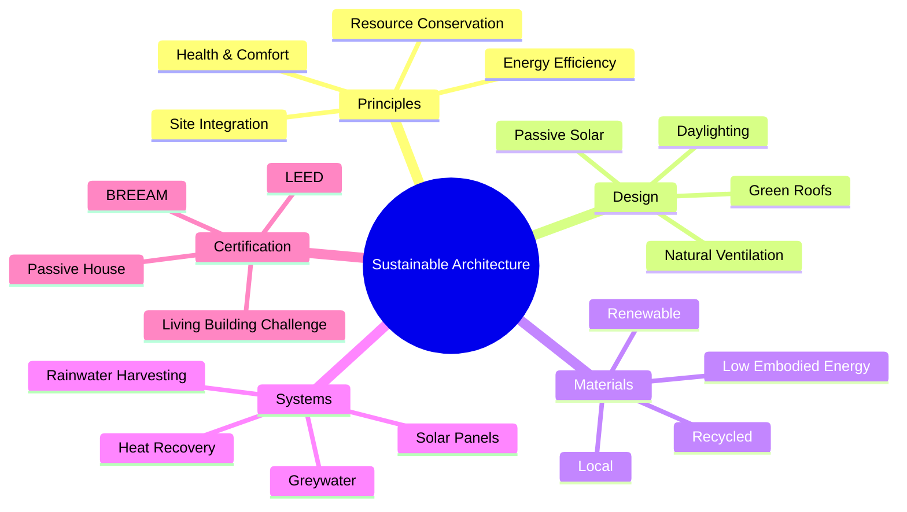

```mermaid
mindmap
  root((Sustainable Architecture))
    Principles
      Energy Efficiency
      Resource Conservation
      Health & Comfort
      Site Integration
    Design
      Passive Solar
      Natural Ventilation
      Daylighting
      Green Roofs
    Materials
      Recycled
      Renewable
      Local
      Low Embodied Energy
    Systems
      Solar Panels
      Rainwater Harvesting
      Greywater
      Heat Recovery
    Certification
      LEED
      BREEAM
      Passive House
      Living Building Challenge
```

