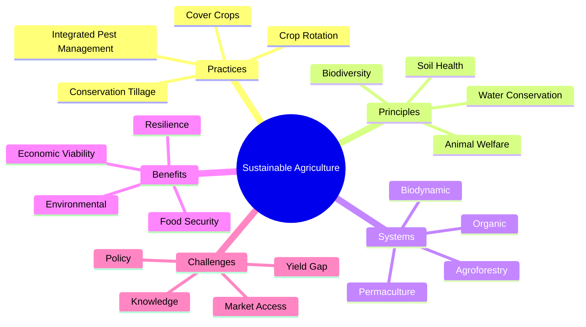

```mermaid
mindmap
  root((Sustainable Agriculture))
    Practices
      Crop Rotation
      Cover Crops
      Integrated Pest Management
      Conservation Tillage
    Principles
      Soil Health
      Biodiversity
      Water Conservation
      Animal Welfare
    Systems
      Organic
      Agroforestry
      Permaculture
      Biodynamic
    Benefits
      Food Security
      Environmental
      Economic Viability
      Resilience
    Challenges
      Yield Gap
      Market Access
      Knowledge
      Policy
```

