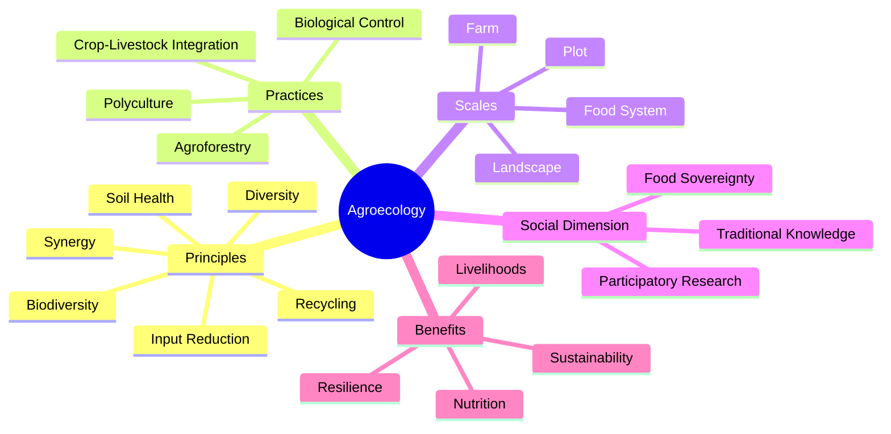

```mermaid
mindmap
  root((Agroecology))
    Principles
      Recycling
      Input Reduction
      Soil Health
      Biodiversity
      Synergy
      Diversity
    Practices
      Polyculture
      Agroforestry
      Crop-Livestock Integration
      Biological Control
    Scales
      Plot
      Farm
      Landscape
      Food System
    Social Dimension
      Traditional Knowledge
      Food Sovereignty
      Participatory Research
    Benefits
      Resilience
      Sustainability
      Nutrition
      Livelihoods
```

