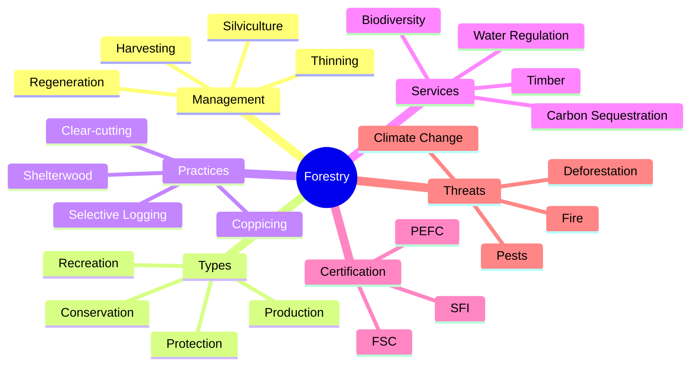

```mermaid
mindmap
  root((Forestry))
    Management
      Silviculture
      Harvesting
      Regeneration
      Thinning
    Types
      Production
      Protection
      Recreation
      Conservation
    Practices
      Selective Logging
      Clear-cutting
      Shelterwood
      Coppicing
    Services
      Timber
      Carbon Sequestration
      Water Regulation
      Biodiversity
    Certification
      FSC
      PEFC
      SFI
    Threats
      Deforestation
      Pests
      Fire
      Climate Change
```

