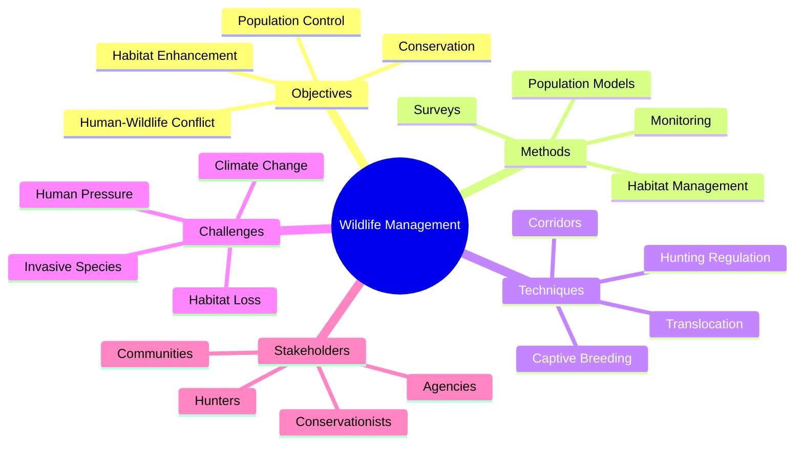

```mermaid
mindmap
  root((Wildlife Management))
    Objectives
      Conservation
      Population Control
      Habitat Enhancement
      Human-Wildlife Conflict
    Methods
      Surveys
      Monitoring
      Population Models
      Habitat Management
    Techniques
      Translocation
      Corridors
      Captive Breeding
      Hunting Regulation
    Challenges
      Habitat Loss
      Climate Change
      Invasive Species
      Human Pressure
    Stakeholders
      Agencies
      Communities
      Hunters
      Conservationists
```

