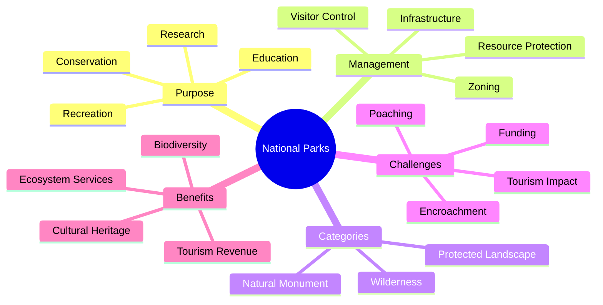

```mermaid
mindmap
  root((National Parks))
    Purpose
      Conservation
      Recreation
      Education
      Research
    Management
      Zoning
      Visitor Control
      Resource Protection
      Infrastructure
    Categories
      Wilderness
      Natural Monument
      Protected Landscape
    Challenges
      Tourism Impact
      Poaching
      Encroachment
      Funding
    Benefits
      Biodiversity
      Ecosystem Services
      Tourism Revenue
      Cultural Heritage
```

