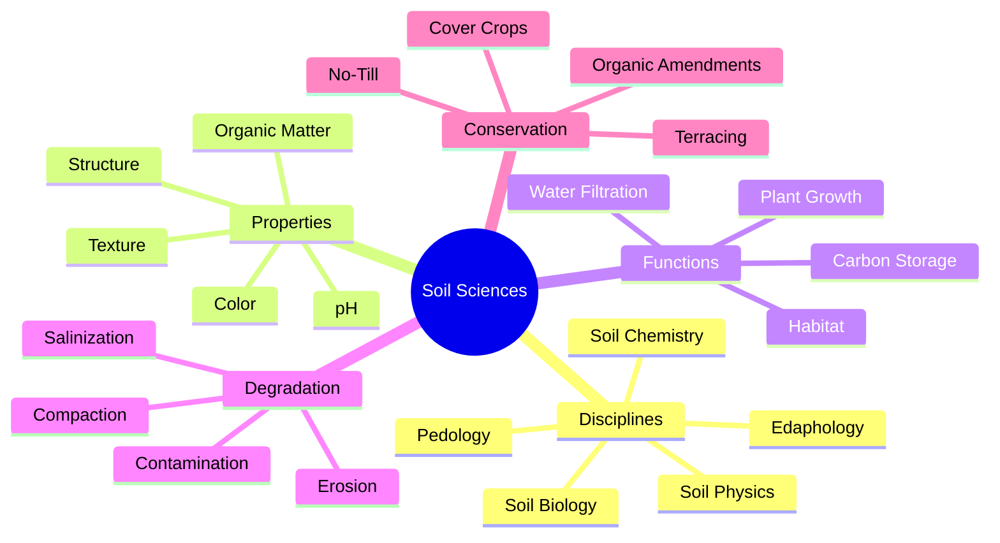

```mermaid
mindmap
  root((Soil Sciences))
    Disciplines
      Pedology
      Edaphology
      Soil Chemistry
      Soil Physics
      Soil Biology
    Properties
      Texture
      Structure
      Color
      pH
      Organic Matter
    Functions
      Plant Growth
      Water Filtration
      Carbon Storage
      Habitat
    Degradation
      Erosion
      Compaction
      Salinization
      Contamination
    Conservation
      Cover Crops
      Terracing
      No-Till
      Organic Amendments
```

