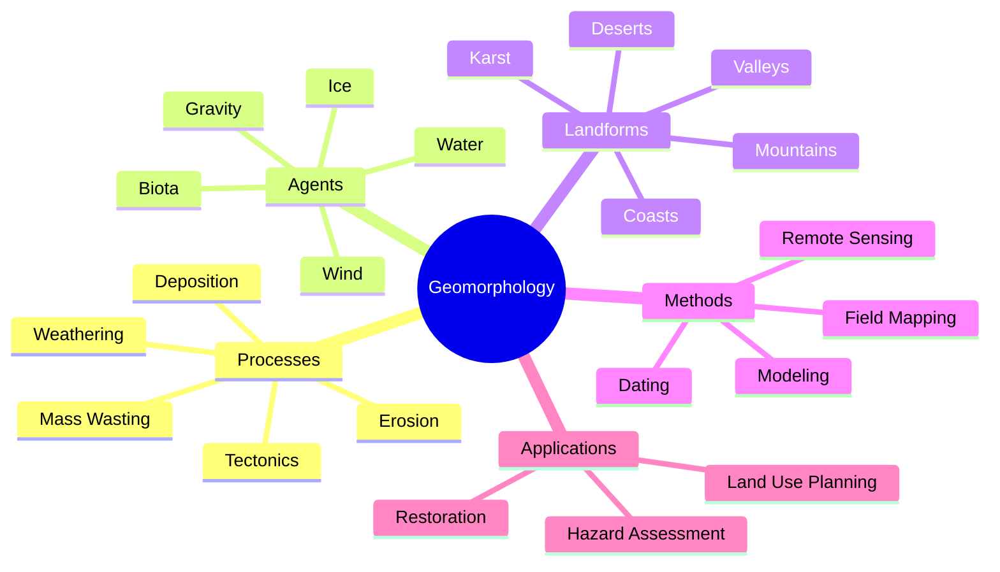

```mermaid
mindmap
  root((Geomorphology))
    Processes
      Weathering
      Erosion
      Deposition
      Mass Wasting
      Tectonics
    Agents
      Water
      Wind
      Ice
      Gravity
      Biota
    Landforms
      Mountains
      Valleys
      Coasts
      Deserts
      Karst
    Methods
      Field Mapping
      Remote Sensing
      Dating
      Modeling
    Applications
      Hazard Assessment
      Land Use Planning
      Restoration
```

