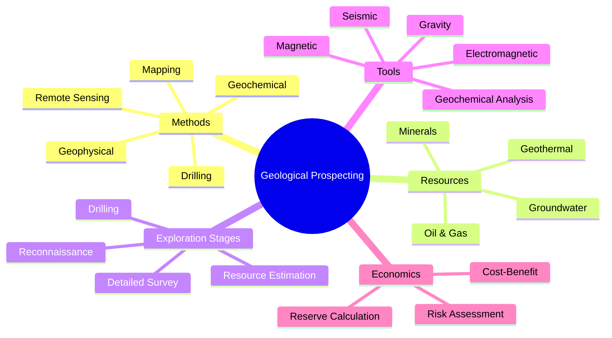

```mermaid
mindmap
  root((Geological Prospecting))
    Methods
      Geophysical
      Geochemical
      Remote Sensing
      Drilling
      Mapping
    Resources
      Minerals
      Oil & Gas
      Groundwater
      Geothermal
    Exploration Stages
      Reconnaissance
      Detailed Survey
      Drilling
      Resource Estimation
    Tools
      Seismic
      Magnetic
      Gravity
      Electromagnetic
      Geochemical Analysis
    Economics
      Cost-Benefit
      Risk Assessment
      Reserve Calculation
```

