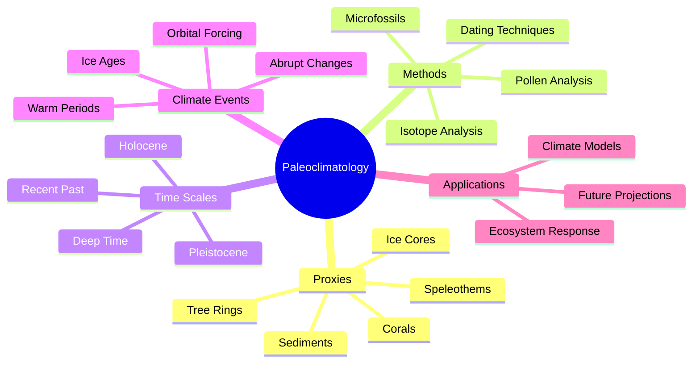

```mermaid
mindmap
  root((Paleoclimatology))
    Proxies
      Ice Cores
      Tree Rings
      Sediments
      Corals
      Speleothems
    Methods
      Isotope Analysis
      Pollen Analysis
      Microfossils
      Dating Techniques
    Time Scales
      Recent Past
      Holocene
      Pleistocene
      Deep Time
    Climate Events
      Ice Ages
      Warm Periods
      Abrupt Changes
      Orbital Forcing
    Applications
      Climate Models
      Future Projections
      Ecosystem Response
```

