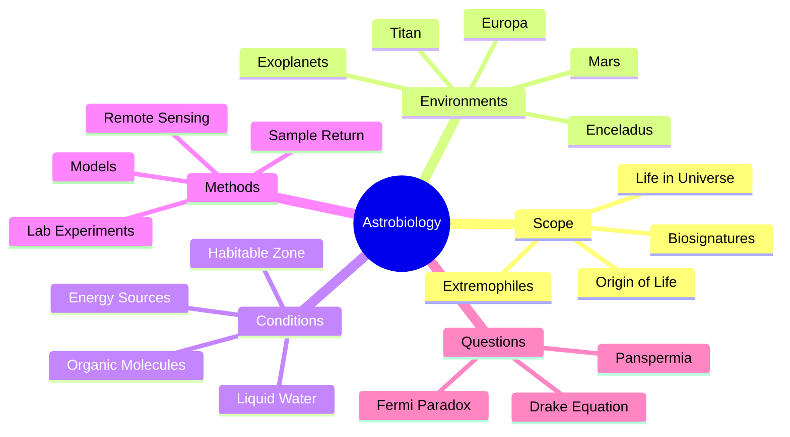

```mermaid
mindmap
  root((Astrobiology))
    Scope
      Origin of Life
      Life in Universe
      Extremophiles
      Biosignatures
    Environments
      Mars
      Europa
      Enceladus
      Titan
      Exoplanets
    Conditions
      Liquid Water
      Energy Sources
      Organic Molecules
      Habitable Zone
    Methods
      Remote Sensing
      Sample Return
      Lab Experiments
      Models
    Questions
      Panspermia
      Drake Equation
      Fermi Paradox
```

