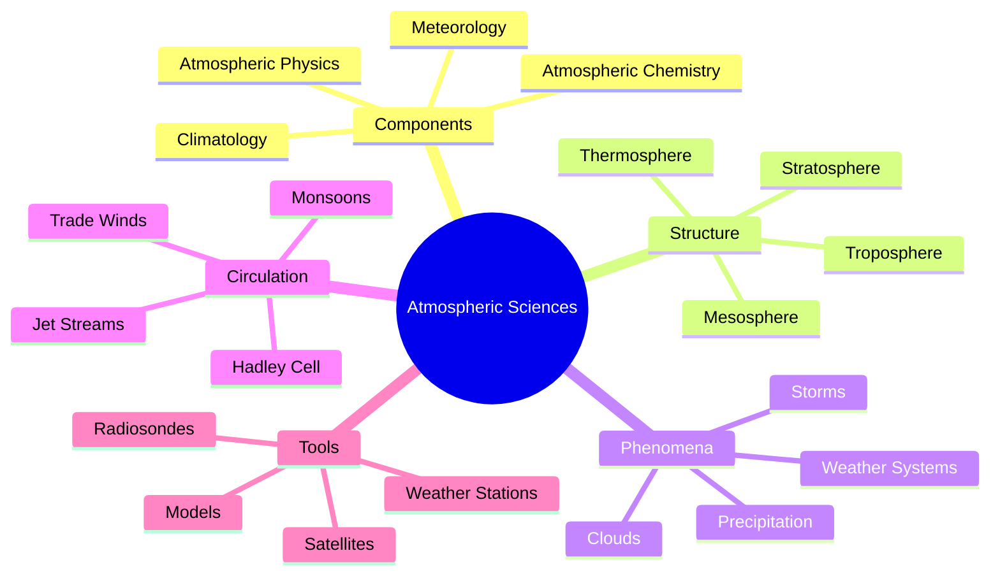

```mermaid
mindmap
  root((Atmospheric Sciences))
    Components
      Meteorology
      Climatology
      Atmospheric Chemistry
      Atmospheric Physics
    Structure
      Troposphere
      Stratosphere
      Mesosphere
      Thermosphere
    Phenomena
      Weather Systems
      Storms
      Clouds
      Precipitation
    Circulation
      Hadley Cell
      Jet Streams
      Monsoons
      Trade Winds
    Tools
      Satellites
      Radiosondes
      Weather Stations
      Models
```

