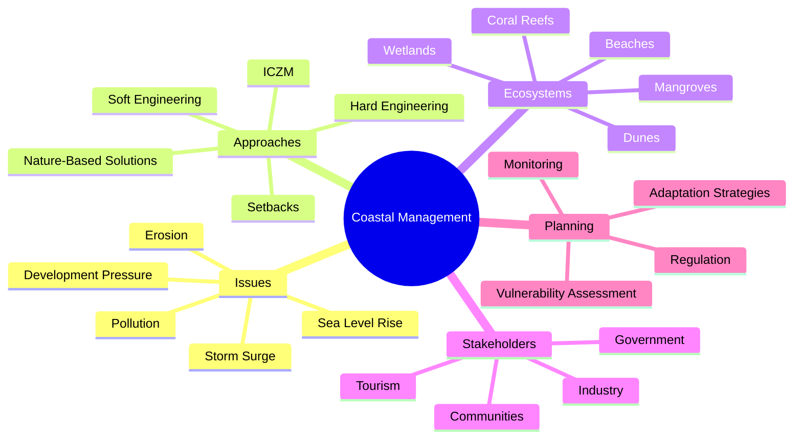

```mermaid
mindmap
  root((Coastal Management))
    Issues
      Erosion
      Sea Level Rise
      Storm Surge
      Development Pressure
      Pollution
    Approaches
      ICZM
      Setbacks
      Nature-Based Solutions
      Hard Engineering
      Soft Engineering
    Ecosystems
      Beaches
      Dunes
      Wetlands
      Mangroves
      Coral Reefs
    Stakeholders
      Communities
      Government
      Industry
      Tourism
    Planning
      Vulnerability Assessment
      Adaptation Strategies
      Monitoring
      Regulation
```

