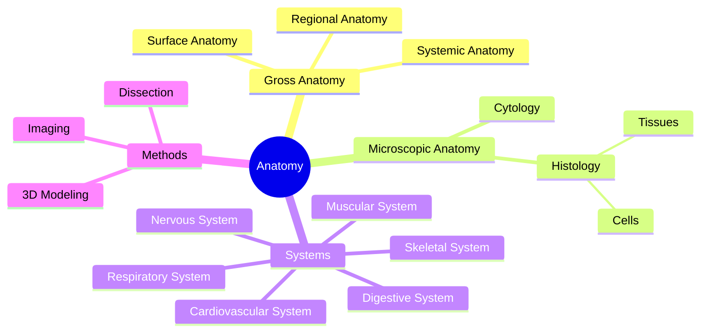

```mermaid
mindmap
  root((Anatomy))
    Gross Anatomy
      Regional Anatomy
      Systemic Anatomy
      Surface Anatomy
    Microscopic Anatomy
      Histology
        Tissues
        Cells
      Cytology
    Systems
      Skeletal System
      Muscular System
      Cardiovascular System
      Nervous System
      Respiratory System
      Digestive System
    Methods
      Dissection
      Imaging
      3D Modeling
```

