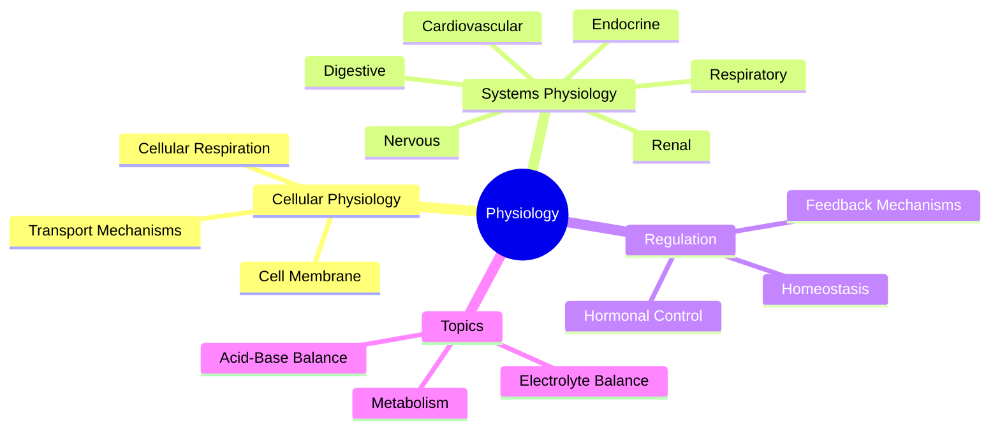

```mermaid
mindmap
  root((Physiology))
    Cellular Physiology
      Cell Membrane
      Transport Mechanisms
      Cellular Respiration
    Systems Physiology
      Cardiovascular
      Respiratory
      Renal
      Endocrine
      Digestive
      Nervous
    Regulation
      Homeostasis
      Feedback Mechanisms
      Hormonal Control
    Topics
      Metabolism
      Electrolyte Balance
      Acid-Base Balance
```

