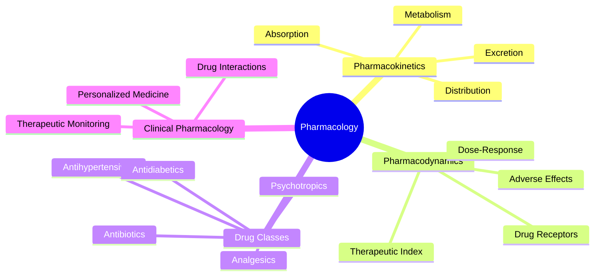

```mermaid
mindmap
  root((Pharmacology))
    Pharmacokinetics
      Absorption
      Distribution
      Metabolism
      Excretion
    Pharmacodynamics
      Drug Receptors
      Dose-Response
      Therapeutic Index
      Adverse Effects
    Drug Classes
      Antibiotics
      Analgesics
      Antihypertensives
      Antidiabetics
      Psychotropics
    Clinical Pharmacology
      Drug Interactions
      Personalized Medicine
      Therapeutic Monitoring
```

