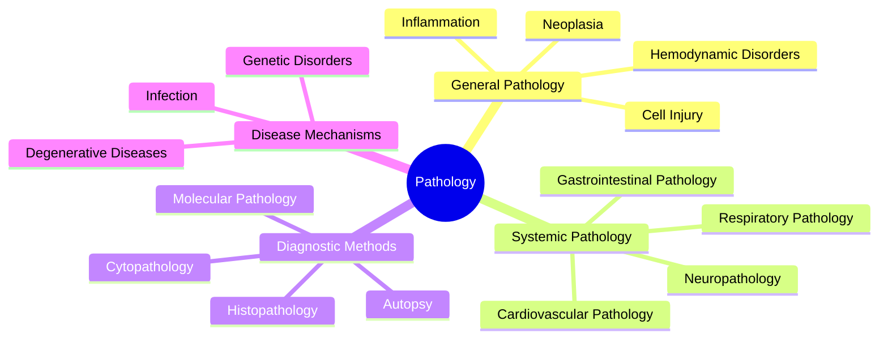

```mermaid
mindmap
  root((Pathology))
    General Pathology
      Cell Injury
      Inflammation
      Neoplasia
      Hemodynamic Disorders
    Systemic Pathology
      Cardiovascular Pathology
      Respiratory Pathology
      Gastrointestinal Pathology
      Neuropathology
    Diagnostic Methods
      Histopathology
      Cytopathology
      Molecular Pathology
      Autopsy
    Disease Mechanisms
      Infection
      Genetic Disorders
      Degenerative Diseases
```

