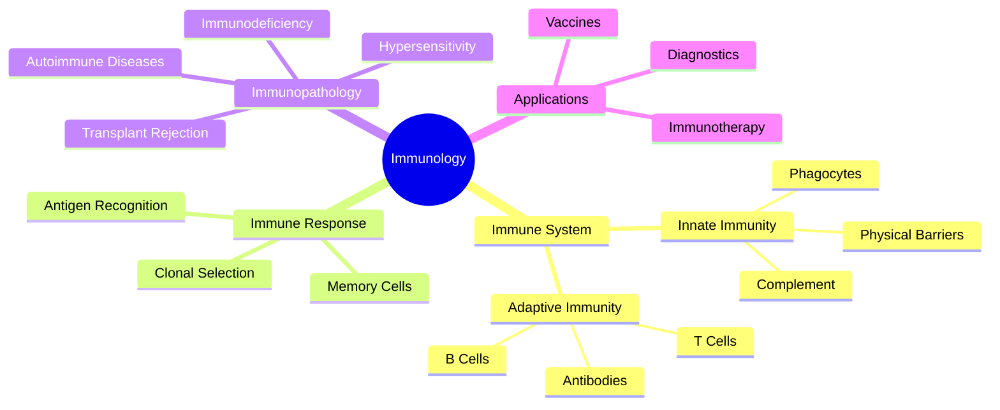

```mermaid
mindmap
  root((Immunology))
    Immune System
      Innate Immunity
        Physical Barriers
        Phagocytes
        Complement
      Adaptive Immunity
        T Cells
        B Cells
        Antibodies
    Immune Response
      Antigen Recognition
      Clonal Selection
      Memory Cells
    Immunopathology
      Autoimmune Diseases
      Immunodeficiency
      Hypersensitivity
      Transplant Rejection
    Applications
      Vaccines
      Immunotherapy
      Diagnostics
```

