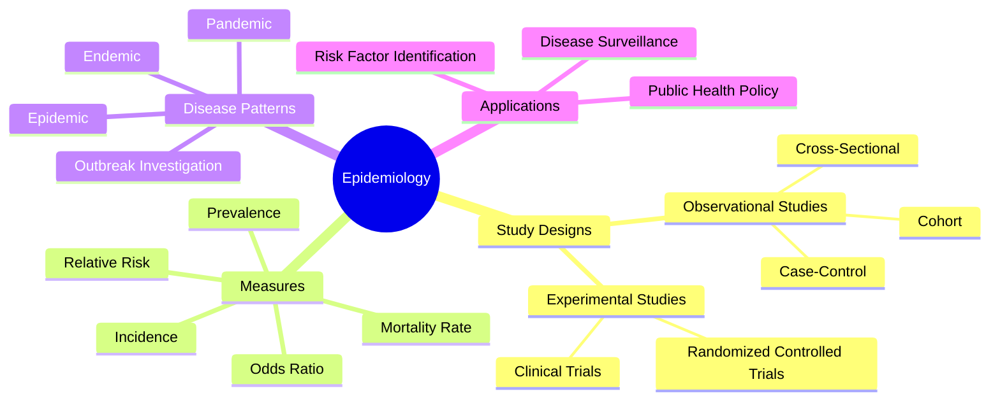

```mermaid
mindmap
  root((Epidemiology))
    Study Designs
      Observational Studies
        Cohort
        Case-Control
        Cross-Sectional
      Experimental Studies
        Randomized Controlled Trials
        Clinical Trials
    Measures
      Incidence
      Prevalence
      Mortality Rate
      Relative Risk
      Odds Ratio
    Disease Patterns
      Endemic
      Epidemic
      Pandemic
      Outbreak Investigation
    Applications
      Disease Surveillance
      Public Health Policy
      Risk Factor Identification
```

