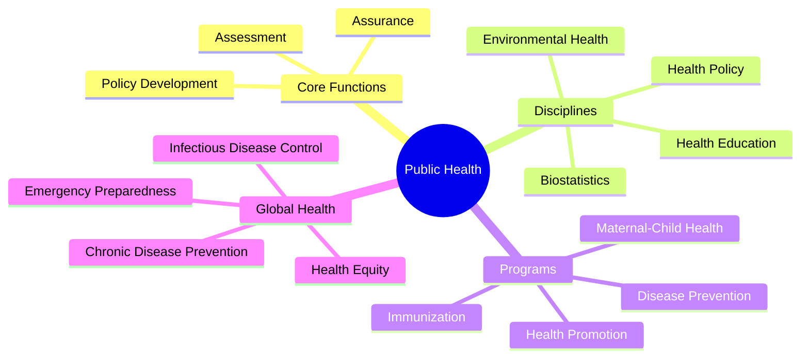

```mermaid
mindmap
  root((Public Health))
    Core Functions
      Assessment
      Policy Development
      Assurance
    Disciplines
      Environmental Health
      Health Education
      Health Policy
      Biostatistics
    Programs
      Disease Prevention
      Health Promotion
      Immunization
      Maternal-Child Health
    Global Health
      Infectious Disease Control
      Chronic Disease Prevention
      Health Equity
      Emergency Preparedness
```

