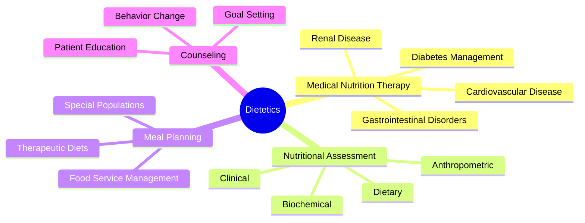

```mermaid
mindmap
  root((Dietetics))
    Medical Nutrition Therapy
      Diabetes Management
      Cardiovascular Disease
      Renal Disease
      Gastrointestinal Disorders
    Nutritional Assessment
      Anthropometric
      Biochemical
      Clinical
      Dietary
    Meal Planning
      Therapeutic Diets
      Special Populations
      Food Service Management
    Counseling
      Behavior Change
      Patient Education
      Goal Setting
```

