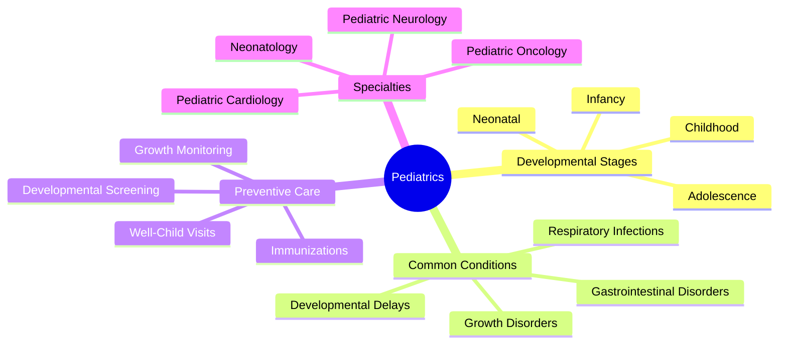

```mermaid
mindmap
  root((Pediatrics))
    Developmental Stages
      Neonatal
      Infancy
      Childhood
      Adolescence
    Common Conditions
      Respiratory Infections
      Gastrointestinal Disorders
      Growth Disorders
      Developmental Delays
    Preventive Care
      Well-Child Visits
      Immunizations
      Growth Monitoring
      Developmental Screening
    Specialties
      Neonatology
      Pediatric Cardiology
      Pediatric Neurology
      Pediatric Oncology
```

