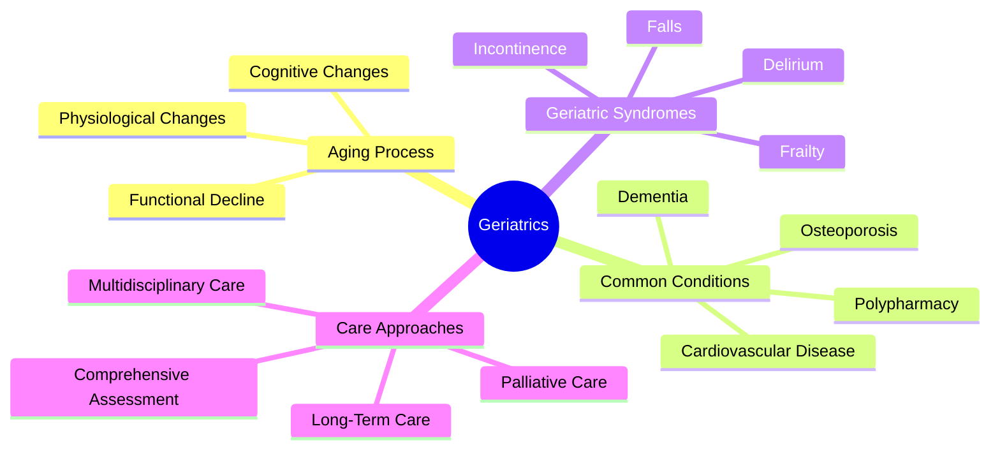

```mermaid
mindmap
  root((Geriatrics))
    Aging Process
      Physiological Changes
      Cognitive Changes
      Functional Decline
    Common Conditions
      Dementia
      Osteoporosis
      Cardiovascular Disease
      Polypharmacy
    Geriatric Syndromes
      Falls
      Frailty
      Incontinence
      Delirium
    Care Approaches
      Comprehensive Assessment
      Multidisciplinary Care
      Palliative Care
      Long-Term Care
```

