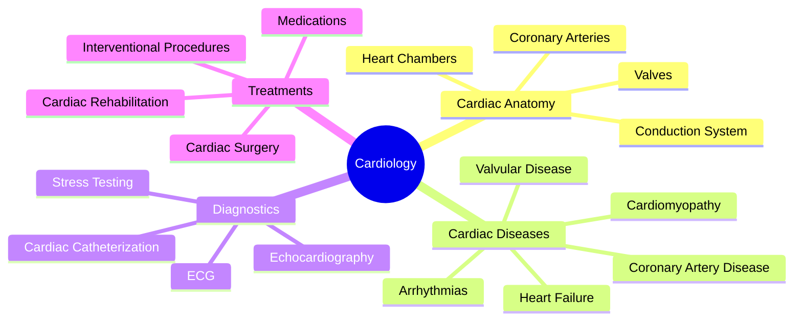

```mermaid
mindmap
  root((Cardiology))
    Cardiac Anatomy
      Heart Chambers
      Valves
      Coronary Arteries
      Conduction System
    Cardiac Diseases
      Coronary Artery Disease
      Heart Failure
      Arrhythmias
      Valvular Disease
      Cardiomyopathy
    Diagnostics
      ECG
      Echocardiography
      Cardiac Catheterization
      Stress Testing
    Treatments
      Medications
      Interventional Procedures
      Cardiac Surgery
      Cardiac Rehabilitation
```

