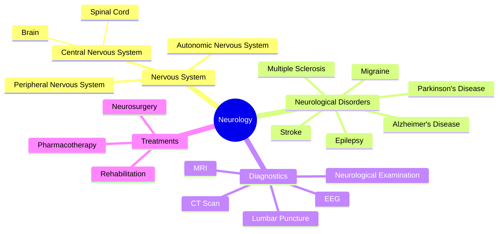

```mermaid
mindmap
  root((Neurology))
    Nervous System
      Central Nervous System
        Brain
        Spinal Cord
      Peripheral Nervous System
      Autonomic Nervous System
    Neurological Disorders
      Stroke
      Epilepsy
      Multiple Sclerosis
      Parkinson's Disease
      Alzheimer's Disease
      Migraine
    Diagnostics
      Neurological Examination
      EEG
      MRI
      CT Scan
      Lumbar Puncture
    Treatments
      Pharmacotherapy
      Neurosurgery
      Rehabilitation
```

