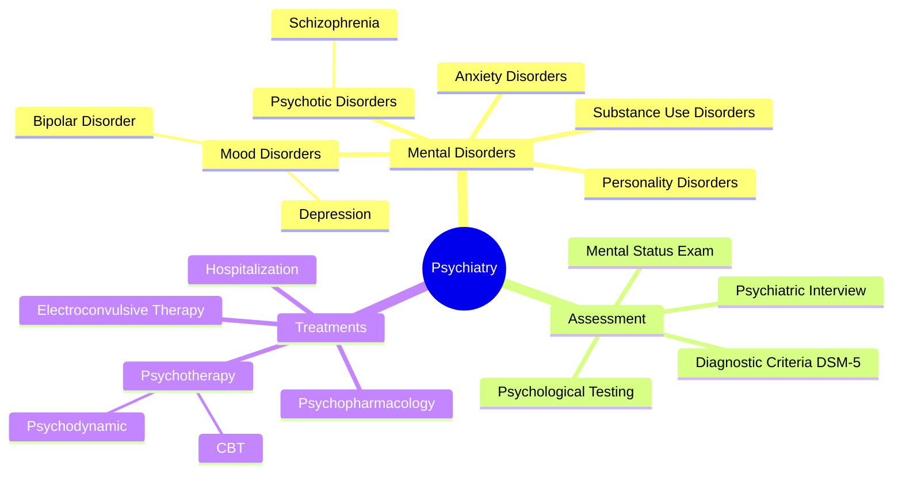

```mermaid
mindmap
  root((Psychiatry))
    Mental Disorders
      Mood Disorders
        Depression
        Bipolar Disorder
      Anxiety Disorders
      Psychotic Disorders
        Schizophrenia
      Personality Disorders
      Substance Use Disorders
    Assessment
      Psychiatric Interview
      Mental Status Exam
      Psychological Testing
      Diagnostic Criteria DSM-5
    Treatments
      Psychopharmacology
      Psychotherapy
        CBT
        Psychodynamic
      Electroconvulsive Therapy
      Hospitalization
```

